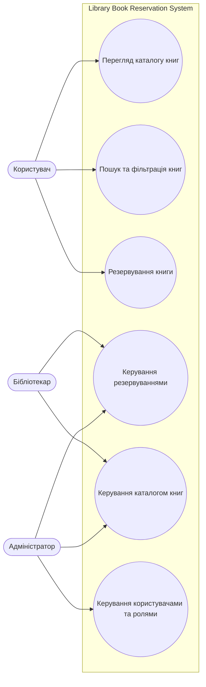

## Use Case Diagram

```mermaid
flowchart LR
    User([Користувач])
    Librarian([Бібліотекар])
    Admin([Адміністратор])

    subgraph System[Library Book Reservation System]
        UC1((Перегляд каталогу книг))
        UC2((Пошук та фільтрація книг))
        UC3((Резервування книги))
        UC4((Керування резервуваннями))
        UC5((Керування каталогом книг))
        UC6((Керування користувачами та ролями))
    end

    User --> UC1
    User --> UC2
    User --> UC3

    Librarian --> UC4
    Librarian --> UC5

    Admin --> UC6
    Admin --> UC5
    Admin --> UC4
```
